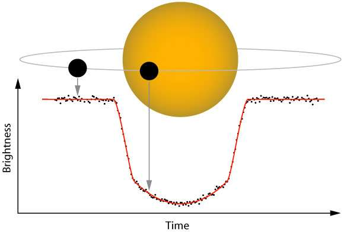

# spark-ml-lr-ExoplanetsClassification
Build a classification model of exoplanets labeled "confirmed" or "false-positive". we will use Spark Machine Learning Logistic regression written in Scala for building our model.

# 

  

